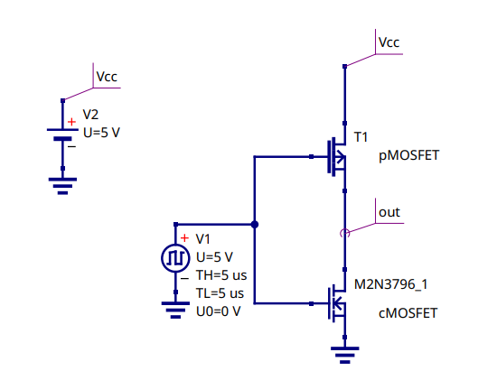

# TTL-VS-CMOS-LAB-DIGITAL-1
El propósito de este laboratorio es analizar las características y ventajas de cada tecnología mediante experimentos prácticos. Esto permitirá observar su comportamiento en diferentes condiciones operativas y determinar cuál resulta más adecuado para ciertas aplicaciones. Durante este proceso, se evaluarán factores como:

-tiempo de subida y bajada
-tiempo de retardo
- disipacion de potencia
- fan-in y fan-out

encontramos el circuito equivalente de cada negador

## Circuito equivalente  74LS04

## Circuito equivalente  CD4069

para hacer esta practica se desarrollan las simulaciones de los parametros , como se muestra en las siguientes imagenes

# Practica 1: COMPARACIÓN DE TECNOLOGÍA CMOS y TTL

## Abstract
This project focuses on the comparative analysis of two fundamental technologies in the design and development of digital circuits: **TTL (Transistor-Transistor Logic)** and **CMOS (Complementary Metal-Oxide-Semiconductor)**. These architectures have been pivotal in the evolution of digital electronics and are widely used in various applications, ranging from computing systems to mobile devices and consumer electronics.

## Keywords
- TTL (Transistor-Transistor Logic)
- CMOS (Complementary Metal-Oxide-Semiconductor)
- Digital Circuits
- Semiconductor Technology
- Logic Gates
- Electronic Circuit Design

---

## Resumen
El presente proyecto se enfoca en el análisis comparativo entre dos tecnologías fundamentales en el diseño y desarrollo de circuitos digitales: **TTL (Transistor-Transistor Logic)** y **CMOS (Semiconductor Complementario de Óxido Metálico)**. Estas arquitecturas han sido pilares en la evolución de la electrónica digital y se utilizan ampliamente en diferentes aplicaciones, desde sistemas de computación hasta dispositivos móviles y electrónicos de consumo.

## Introducción
La electrónica digital es un área fundamental en el desarrollo de sistemas modernos, ya que permite el procesamiento de señales a través de circuitos que operan con valores discretos. Estos circuitos se implementan utilizando diversas tecnologías de fabricación, cada una con sus propias características y ventajas. Entre las tecnologías más comunes para la construcción de circuitos digitales se encuentran **TTL (Transistor-Transistor Logic)** y **CMOS (Complementary Metal-Oxide-Semiconductor)**. Ambas son ampliamente utilizadas en la creación de puertas lógicas y otros componentes esenciales en sistemas electrónicos.
    En este laboratorio, se realizará un análisis comparativo entre las tecnologías TTL y CMOS mediante la implementación de un negador (inversor) en ambos casos. El propósito es observar y analizar las diferencias entre los circuitos de **TTL 74LS04 y CMOS CD4069** en términos de diseño, tiempo de respuesta y consumo de energía. A través de esta comparación, se busca entender cómo las características propias de cada tecnología impactan en el rendimiento de un circuito básico y cómo se comportan bajo condiciones operativas similares. El análisis ayudará a identificar las ventajas y desventajas de cada tecnología, proporcionando una base sólida para seleccionar la más adecuada según las necesidades de un proyecto de diseño de circuitos digitales

---

## Objetivos
- Identificar las características de un dispositivo fabricado en diferentes tecnologías.
- Evaluar las ventajas y desventajas de las tecnologías **TTL** y **CMOS** en términos de diseño, tiempo de respuesta y consumo energético.

---

## Recursos Requeridos
- Negador **TTL 74LS04**
- Negador **CMOS CD4069**
- Simulador
- Datasheets
- Modelos Spice

---

## Circuitos Equivalentes

### TTL Circuit

### CMOS Circuit

---

El tiempo de subida, tiempo de bajada y retardo son parámetros clave para evaluar el rendimiento dinámico de los circuitos digitales, especialmente en dispositivos como negadores (inversores) implementados con tecnologías como TTL y CMOS. Estos tiempos se refieren a las transiciones de una señal de entrada a una señal de salida en un circuito lógico, y se pueden medir experimentalmente utilizando equipos como osciloscopios y generadores de señales.

\subsection{tiempo se subida}
El tiempo de subida hace referencia al intervalo de tiempo que tarda la señal de salida en pasar de un valor bajo (0) a un valor alto (1) cuando se aplica un pulso de entrada. Este tiempo de transición es importante para tener ese parametro y utilizar la tecnologia segun convenga para la aplicacion que vamos a utilizar cada negador.

El tiempo de subida es de 104 nS

El tiempo de subida es de 118 nS

\subsection{tiempo de bajada}

El tiempo de bajada es el tiempo que tarda la señal de salida en pasar de un valor alto a un valor bajo, como en el caso se aplica un pulso de entrada y se mira la onda que genera con el oscilosciopio y se encuentra el tiempo que demora en hace el cambio de 1 a 0. esto es importnte por que al igual que en el tiempo de subida de esto podemos necesitar un rango de tiemo de bajada especifico segun la aplicacion

El tiempo de bajada es de 338 nS

El tiempo de bajada es de 1.16 uS

\subsection{tiempo de retardo}

El tiempo de retardo en negadores se refiere al tiempo que tarda un circuito digital, como un inversor (negador), en cambiar su salida después de que haya ocurrido un cambio en su entrada. Este retardo es una propiedad inherente de los dispositivos electrónicos utilizados en la construcción de circuitos lógicos, como transistores, y es fundamental en el diseño de circuitos rápidos y eficientes.
Los transistores CMOS y TTL tienen tiempos de retardo diferentes. Por ejemplo, los transistores CMOS generalmente tienen un retardo más bajo en comparación con los TTL debido a su menor consumo de energía y mejor eficiencia en la conmutación.
Es el tiempo que tarda la señal en propagarse desde la entrada hasta la salida del negador.

El tiempo de retardo es de 84 nS

El tiempo de retardo 496 ns

---
## Especificaciones Técnicas

### Tiempos
El tiempo de subida, tiempo de bajada y tiempo de retardo son parámetros clave para evaluar el rendimiento dinámico de los circuitos digitales:

#### Tiempo de Subida
- **74LS04 (TTL)**: 104 nS  
  
- **CD4069 (CMOS)**: 118 nS  
  

#### Tiempo de Bajada
- **74LS04 (TTL)**: 338 nS  
  
- **CD4069 (CMOS)**: 1.16 µS  
  

#### Tiempo de Retardo
- **74LS04 (TTL)**: 84 nS  
  
- **CD4069 (CMOS)**: 496 nS  
  

---

\section{condiciones del datasheet}
\subsection{TTL}
\\
Segun el datasheet su tiempo de bajada retardo y subida deben estar entre los 10 y 15 nS.
\\
\\
fan-in
\\
Su fan-In es de uno por lo tanto cada compuerta solo puede resivir una entrada.
\\
\\
fan-out
\\
Su fan-Out no se pudo determinar se hiso la medicion hasta 5 y funcionaba bien, pero tipicamente es de alrededor de 10 unidades de carga.
\\
\\
Disipación de potencia
\\
 V_(cc)=2,22 V
 \\
I_(cc)=14,38 mA
\\
P= V_(cc).I_(cc)=32mW

\subsection{CMOS}
Segun el datasheet su tiempo de bajada retardo y subida deben estar entre los 30 y 50 nS.
\\
\\
Fan-In
\\
Su fan-in es de uno por lo tanto cada compuerta solo puede resivir una entrada.
\\
\\
Fan-Out
\\
Su fan out es de 5 unidades de carga.
\\
\\
Disipación de potencia
\\
V_(cc)= 3.25
\\
V Icc = 13.23 uA Potencia disipada = (Vcc)(Icc) 
\\
Pd = V_(cc).I_(cc) =42.99 uW
\\

---

## Oscilador en Anillo Basado en la Compuerta NOT
El oscilador de anillo utiliza un número impar de inversores conectados en un bucle, aprovechando el tiempo de retardo inherente de las puertas digitales. Este retardo genera una oscilación con un periodo de \( 2N \cdot t_p \), donde \( N \) es el número de inversores.

Su diseño y funcionamiento son fundamentales en circuitos digitales para generar señales oscilatorias precisas y medir parámetros como el tiempo de propagación del inversor.

---

