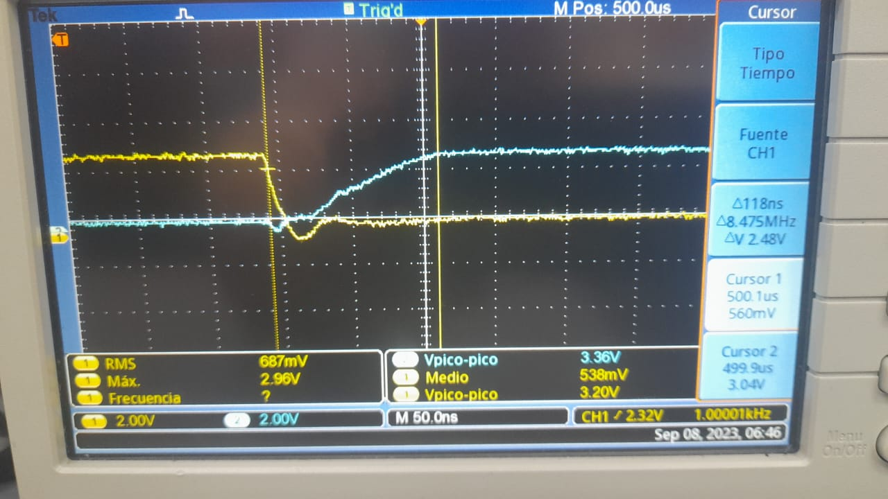
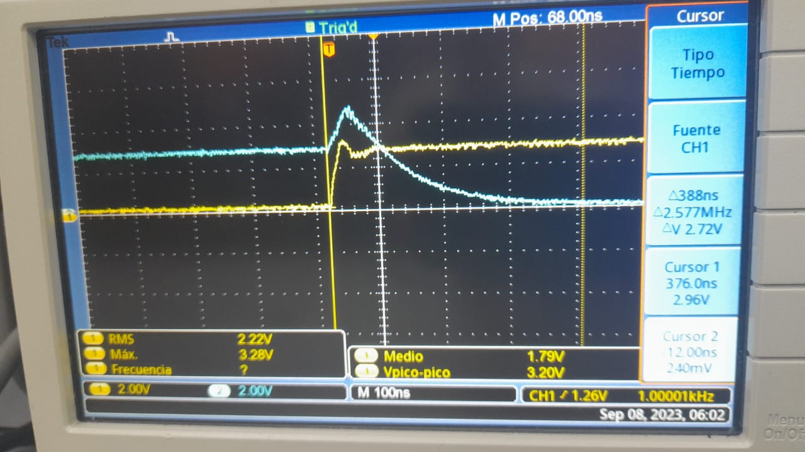
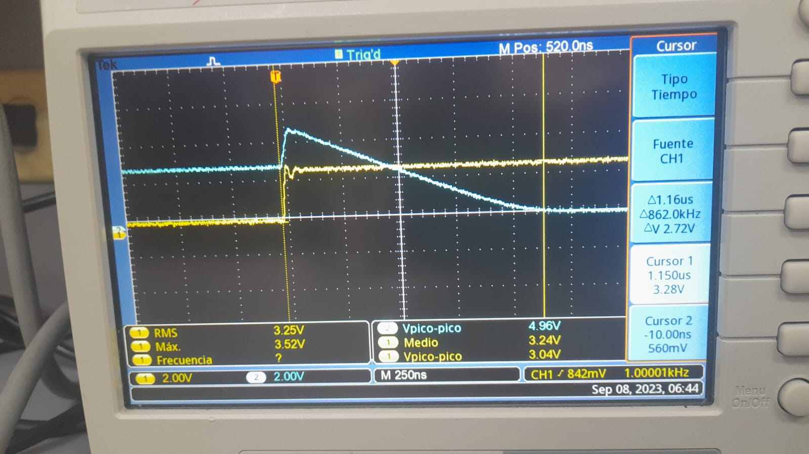
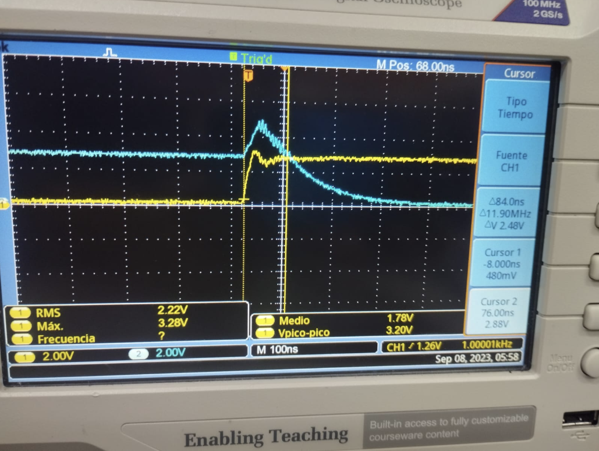
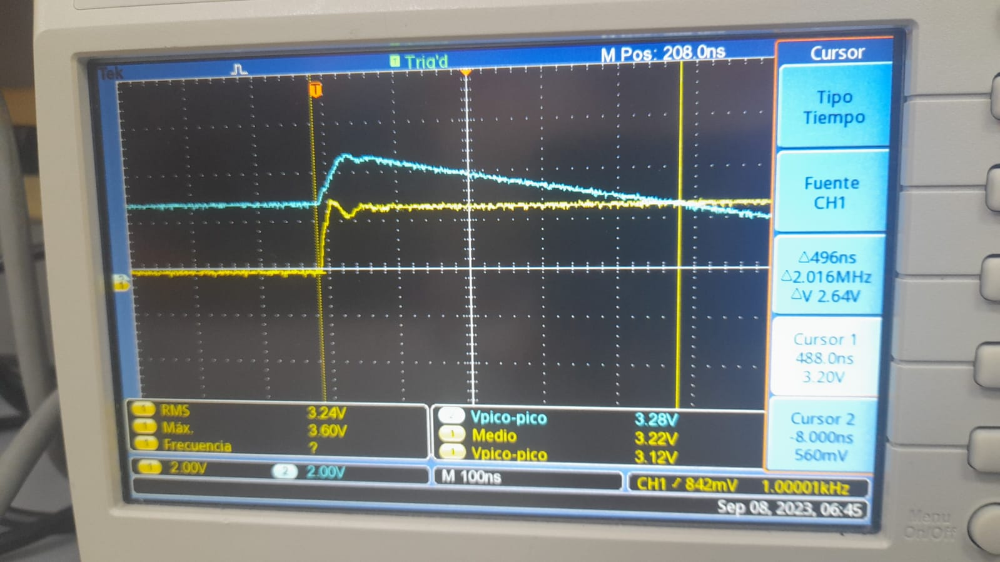
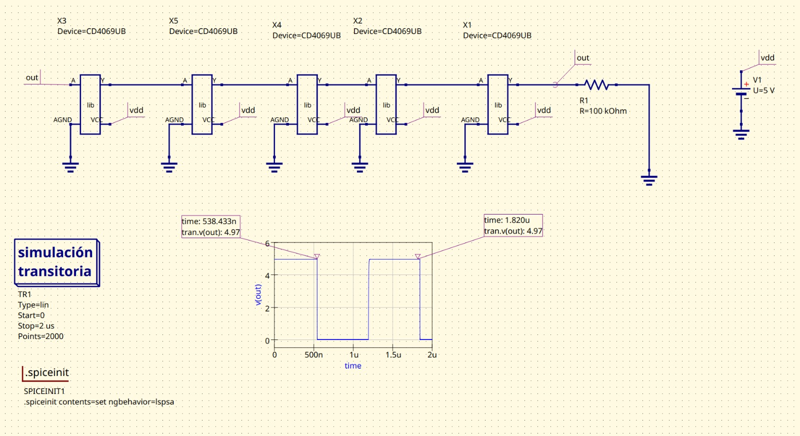
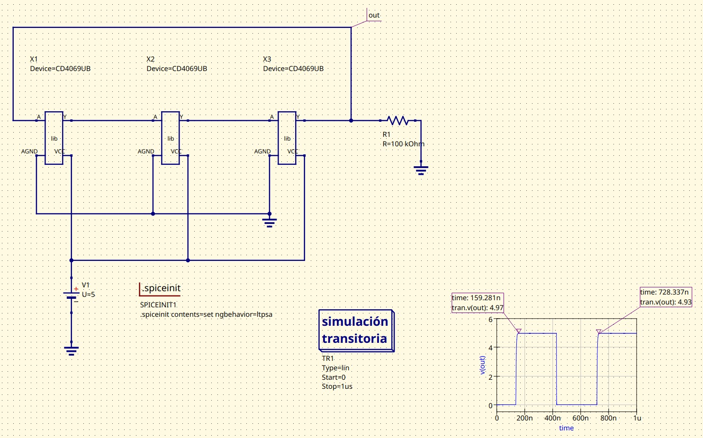
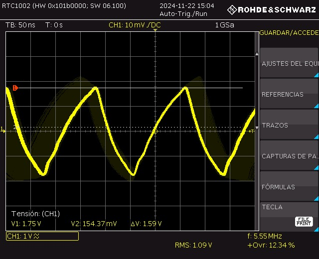
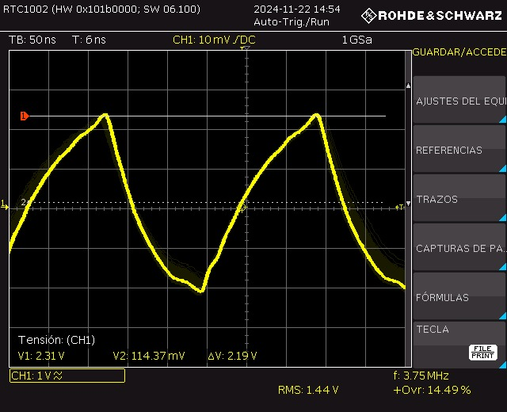

# Practica 1: COMPARACIÓN DE TECNOLOGÍA CMOS y TTL

## Abstract
This project focuses on the comparative analysis of two fundamental technologies in the design and development of digital circuits: **TTL (Transistor-Transistor Logic)** and **CMOS (Complementary Metal-Oxide-Semiconductor)**. These architectures have been pivotal in the evolution of digital electronics and are widely used in various applications, ranging from computing systems to mobile devices and consumer electronics.

## Keywords
- TTL (Transistor-Transistor Logic)
- CMOS (Complementary Metal-Oxide-Semiconductor)
- Digital Circuits
- Semiconductor Technology
- Logic Gates
- Electronic Circuit Design

---

## Resumen
El presente proyecto se enfoca en el análisis comparativo entre dos tecnologías fundamentales en el diseño y desarrollo de circuitos digitales: **TTL (Transistor-Transistor Logic)** y **CMOS (Semiconductor Complementario de Óxido Metálico)**. Estas arquitecturas han sido pilares en la evolución de la electrónica digital y se utilizan ampliamente en diferentes aplicaciones, desde sistemas de computación hasta dispositivos móviles y electrónicos de consumo.

## Introducción
La electrónica digital es un área fundamental en el desarrollo de sistemas modernos, ya que permite el procesamiento de señales a través de circuitos que operan con valores discretos. Estos circuitos se implementan utilizando diversas tecnologías de fabricación, cada una con sus propias características y ventajas. Entre las tecnologías más comunes para la construcción de circuitos digitales se encuentran **TTL (Transistor-Transistor Logic)** y **CMOS (Complementary Metal-Oxide-Semiconductor)**. Ambas son ampliamente utilizadas en la creación de puertas lógicas y otros componentes esenciales en sistemas electrónicos.
    En este laboratorio, se realizará un análisis comparativo entre las tecnologías TTL y CMOS mediante la implementación de un negador (inversor) en ambos casos. El propósito es observar y analizar las diferencias entre los circuitos de **TTL 74LS04 y CMOS CD4069** en términos de diseño, tiempo de respuesta y consumo de energía. A través de esta comparación, se busca entender cómo las características propias de cada tecnología impactan en el rendimiento de un circuito básico y cómo se comportan bajo condiciones operativas similares. El análisis ayudará a identificar las ventajas y desventajas de cada tecnología, proporcionando una base sólida para seleccionar la más adecuada según las necesidades de un proyecto de diseño de circuitos digitales

---

## Objetivos
- Identificar las características de un dispositivo fabricado en diferentes tecnologías.
- Evaluar las ventajas y desventajas de las tecnologías **TTL** y **CMOS** en términos de diseño, tiempo de respuesta y consumo energético.

---

## Recursos Requeridos
- Negador **TTL 74LS04**
- Negador **CMOS CD4069**
- Simulador
- Datasheets
- Modelos Spice

---

## Circuitos Equivalentes

### TTL Circuit

### CMOS Circuit

---

El tiempo de subida, tiempo de bajada y retardo son parámetros clave para evaluar el rendimiento dinámico de los circuitos digitales, especialmente en dispositivos como negadores (inversores) implementados con tecnologías como TTL y CMOS. Estos tiempos se refieren a las transiciones de una señal de entrada a una señal de salida en un circuito lógico, y se pueden medir experimentalmente utilizando equipos como osciloscopios y generadores de señales.

### tiempo se subida

El tiempo de subida hace referencia al intervalo de tiempo que tarda la señal de salida en pasar de un valor bajo (0) a un valor alto (1) cuando se aplica un pulso de entrada. Este tiempo de transición es importante para tener ese parametro y utilizar la tecnologia segun convenga para la aplicacion que vamos a utilizar cada negador.

El tiempo de subida es de 104 nS

El tiempo de subida es de 118 nS

### tiempo de bajada

El tiempo de bajada es el tiempo que tarda la señal de salida en pasar de un valor alto a un valor bajo, como en el caso se aplica un pulso de entrada y se mira la onda que genera con el oscilosciopio y se encuentra el tiempo que demora en hace el cambio de 1 a 0. esto es importnte por que al igual que en el tiempo de subida de esto podemos necesitar un rango de tiemo de bajada especifico segun la aplicacion

El tiempo de bajada es de 338 nS

El tiempo de bajada es de 1.16 uS

### tiempo de retardo

El tiempo de retardo en negadores se refiere al tiempo que tarda un circuito digital, como un inversor (negador), en cambiar su salida después de que haya ocurrido un cambio en su entrada. Este retardo es una propiedad inherente de los dispositivos electrónicos utilizados en la construcción de circuitos lógicos, como transistores, y es fundamental en el diseño de circuitos rápidos y eficientes.
Los transistores CMOS y TTL tienen tiempos de retardo diferentes. Por ejemplo, los transistores CMOS generalmente tienen un retardo más bajo en comparación con los TTL debido a su menor consumo de energía y mejor eficiencia en la conmutación.
Es el tiempo que tarda la señal en propagarse desde la entrada hasta la salida del negador.

El tiempo de retardo es de 84 nS

El tiempo de retardo 496 ns

---

---

### condiciones del datasheet
### TTL
\\
Segun el datasheet su tiempo de bajada retardo y subida deben estar entre los 10 y 15 nS.
\\
\\
fan-in
\\
Su fan-In es de uno por lo tanto cada compuerta solo puede resivir una entrada.
\\
\\
fan-out
\\
Su fan-Out no se pudo determinar se hiso la medicion hasta 5 y funcionaba bien, pero tipicamente es de alrededor de 10 unidades de carga.
\\
\\
Disipación de potencia
\\
 $V_(cc)=2,22 V$
 \\
$I_(cc)=14,38 mA$
\\
$P= V_(cc).I_(cc)=32mW$

### CMOS
Segun el datasheet su tiempo de bajada retardo y subida deben estar entre los 30 y 50 nS.
\\
\\
Fan-In
\\
Su fan-in es de uno por lo tanto cada compuerta solo puede resivir una entrada.
\\
\\
Fan-Out
\\
Su fan out es de 5 unidades de carga.
\\
\\
Disipación de potencia
\\
$V_(cc)= 3.25$
\\
$V Icc = 13.23 uA Potencia disipada = (Vcc)(Icc)$ 
\\
$Pd = V_(cc).I_(cc) =42.99 uW$
\\

---

## Oscilador en Anillo Basado en la Compuerta NOT

El oscilador de anillo es usado comúnmente en circuitos digitales y su funcionamiento  se basa en el retardo inherente de las compuertas digitales, su forma de conexión es es en un lazo con un numero impar de inversores para este caso se usaron de 3 y 5 inversores con un $V_{dd} = 5V$ en donde regresa invertido después de un tiempo de propagación de $Nt_P$.  Para un anillo con N inversores donde es impar este oscilara con un periodo de $2Nt_p$ ademas de que se puede medir el tiempo de propagación del inversor de manera sencilla.

Su funcionamiento consta en el retardo de la puerta y debemos entender que en un dispositivo físico, ninguna compuerta puede cambiar instantáneamente recordando que es un dispositivo fabricado con MOSFETs, teniendo en cuenta que la capacitancia de la compuerta debe ser cargada antes de que la corriente pueda fluir entre el Source y el Drain, entonces la salida de cada inversor en un oscilador en anillo cambia con un pequeño retraso después de que su entrada se modifica. Si se agregan más inversores al circuito, el tiempo total de retraso aumenta, lo que reduce la frecuencia a la que el oscilador funciona. 

Se observa diferencias en las formas de ondas y frecuencias tanto en las simulaciones como en la practica ya que las simulaciones no tiene presente diferentes factores como las capacitancias del negador CMOS por ello en la practica se muestra como formas de carga y descarga, para sus frecuencias el de 5 etapas actua mas lento por tener mas etapas  ya que cada etapa adicional introduce más retraso. En las simulaciones, las formas de onda suelen presentarse como señales perfectamente cuadradas, con transiciones abruptas entre los estados lógicos alto y bajo. Esto se debe a que los modelos de simulación asumen condiciones ideales, donde las compuertas tienen tiempos de conmutación instantáneos y no se consideran las capacitancias internas ni las resistencias parásitas de los dispositivos. Sin embargo, en la práctica, las formas de onda muestran características más complejas. Los tiempos de transición entre niveles lógicos son más graduales debido a las capacitancias internas de las compuertas CMOS. Esto provoca que las señales presenten bordes redondeados, lo que puede interpretarse como formas de carga y descarga en las transiciones. Este comportamiento es especialmente relevante en circuitos con más etapas, donde el efecto acumulativo de estas capacitancias puede volverse más evidente.

En los osciladores en anillo, la frecuencia de oscilación depende directamente del número de etapas y de los tiempos de propagación de cada compuerta. En simulaciones, los tiempos de propagación son constantes y precisos, lo que resulta en frecuencias de oscilación predecibles y consistentes.No obstante, estos tiempos de propagación pueden variar debido a las características físicas de las compuertas, como las capacitancias de entrada y salida, las resistencias internas y las condiciones de alimentación. Esto provoca que las frecuencias medidas en un circuito real sean, generalmente, menores a las obtenidas en simulación. Por ejemplo, en un oscilador de 3 etapas, la frecuencia de oscilación observada en simulación puede ser significativamente mayor que la medida en el laboratorio, aunque la forma de onda en ambas configuraciones siga siendo similar. En contraste, en un oscilador de 5 etapas, no solo se observa una frecuencia más baja debido al mayor número de etapas, sino que también se percibe un efecto más marcado de las capacitancias internas. Esto puede llevar a una mayor distorsión de la señal y a frecuencias de oscilación aún más reducidas en comparación con las simulaciones.

---

